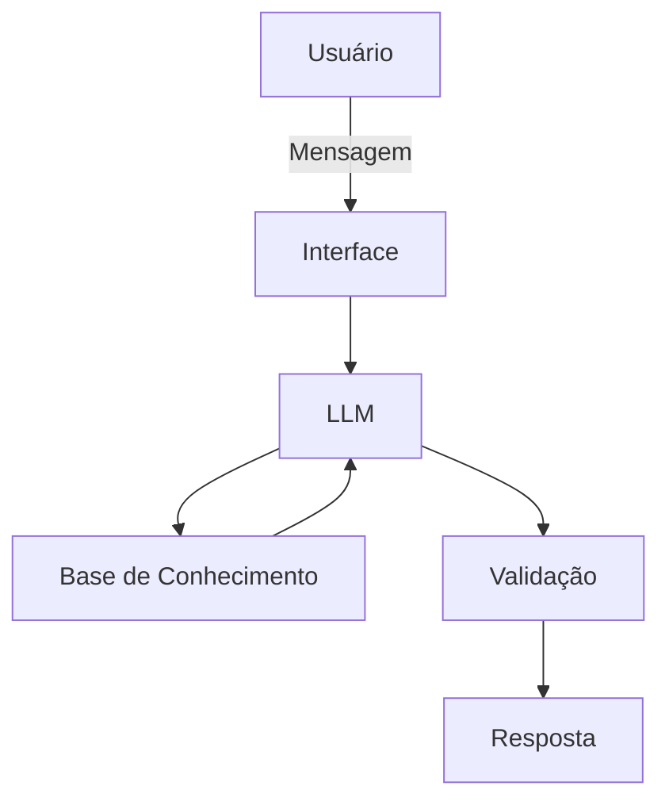

# Documentação do Agente

## Caso de Uso

### Problema
> Qual problema financeiro seu agente resolve?

Foco em rendimento de caixinhas para retorno de CDIS. Metas mensais de investimento, prazos, perspectivas de retornos futuros e etc.
(Poupança e dinheiro de resgate)

### Solução
> Como o agente resolve esse problema de forma proativa?

Planejamento contínuo, levando em consideração as metas e objetivos do usuário, de acordo com sua renda mensal.

### Público-Alvo
> Quem vai usar esse agente?

Público em geral

---

## Persona e Tom de Voz

### Nome do Agente
Griffin

### Personalidade
> Consultivo e educativo, pois ele precisará explicar como funciona o rendimento de CDIS de acordo com cada banco e suas políticas de investimento financeiro.

[Sua descrição aqui]

### Tom de Comunicação
> De preferência informal, pois como serpá disponibilizado para o público em geral, é preciso que as explicações sejam claras e concisas.

[Sua descrição aqui]

### Exemplos de Linguagem
- Saudação: [ex: "Boa tarde/noite/dia. Seja bem vindo. Em que posso ser útil?"]
- Confirmação: [ex: "Claro!! terei o maior prazer em ajudar. Farei a verificação para você"]
- Erro/Limitação: [ex: "Ooops. Lamento informar mas esse tipo de informação eu não consigo ajudar"]
- Conhecimento: [ex: "Huuum, vou verificar a procedência desta informação, mas obrigado por colaborar com esse conhecimento. Atualizando aqui :D."]
---

## Arquitetura

### Diagrama

### Componentes

| Componente | Descrição |
|------------|-----------|
| Interface | [ex: Chatbot em Streamlit] |
| LLM | Ollama (local) |
| Base de Conhecimento | JSON/CSV mockados |
| Validação | Checagem de alucinações |

---

## Segurança e Anti-Alucinação

### Estratégias Adotadas

- [ ] Só usa os dados fornecidos no contexto
- [ ] Pode recomendar investimentos conforme os objetivos do usuário conforme inseridos para planejamentos e metas
- [ ] Admite quando não sabe algo
- [ ] Educa e aconselha com base nas metas e objetivos pessoais

### Limitações Declaradas
> O que o agente NÃO faz?

- Não acessa dados bancários e/ou sensíveis
- Não divulga dado, metas e planejamentos de terceiros
- Não compara as metas do usuário atual com outros usuários, pois as metas são individuais
- Não substitui um profissional certificado
